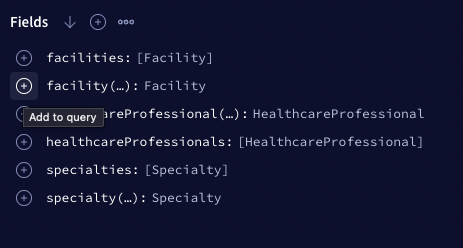
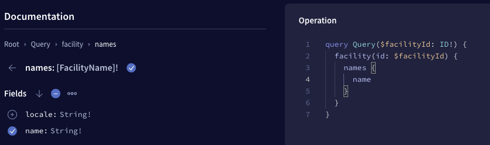
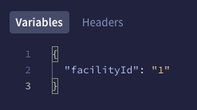

# findadoc-server

## Prerequisites

- Node
  - We recommend using [nvm](https://github.com/nvm-sh/nvm) and running `nvm use` in this directory to sync with the project's Node version. However, if you wish to install Node your own way and ensure a consistent version with `.nvmrc`, that's fine too

## Setup

1. Install dependencies

```sh
yarn install
```

2. Set up Husky Hooks 🐕️

```sh
yarn prepare
```

### Database Setup 🐘
0. Install Postgres (v14.5)
- on OS X
```sh
brew install postgresql
createuser -s postgres
brew services restart postgresql
```

1. Init the database
```sh
./init-db.sh
```

2. Set up `env` variables

```sh
cp .env.sample .env
```

Edit the .env file and set the database password

⚠️ DO NOT CHECK IN PASSWORDS OR ENV FILES INTO GITHUB. ALL SECRETS SHOULD BE MANAGED VIA GITHUB SECRETS


## How to Test

<details>
  <summary>Click to expand</summary>

1. Run `yarn dev` to start the local server
2. Run `yarn generate` to generate the types locally
3. Open your browser to http://localhost:3001/
4. Navigate to the Explorer section from the menu in the left pane.
5. Click `query: Query` under "Root Types
6. Click the `+` button to see the fields a **type** has that can be added to the query
   

7. Select the desired fields and they'll automatically get added to the query builder
   

8. If you select a type that requires an ID (such as `Facility` or `HealthcareProfessional`) then add the ID in the "Variables" window at the bottom _as a string_.



9. If you'd like to share the query you built, such as demonstrating how you tested your code, check out [Apollo Explorer's sharing features](https://www.apollographql.com/blog/announcement/platform/save-and-share-your-graphql-operations-in-apollo-explorer/#sharing-a-collection).

</details>
