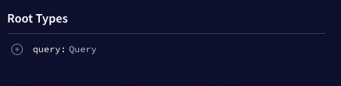
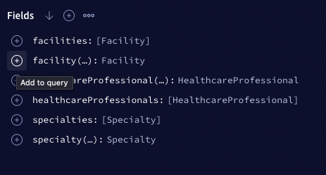
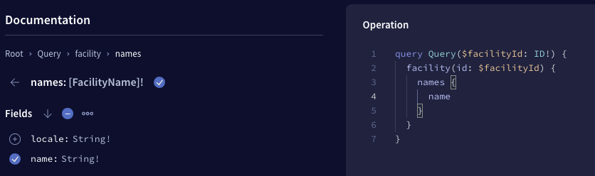
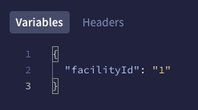
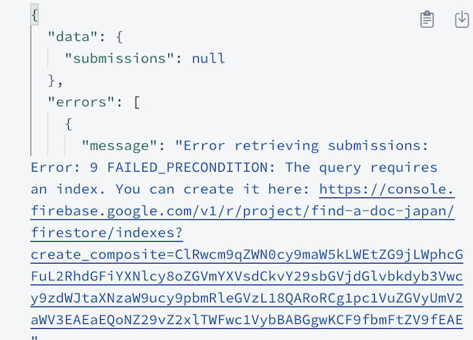
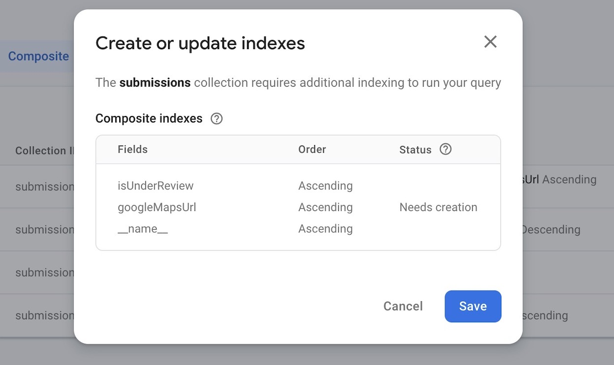
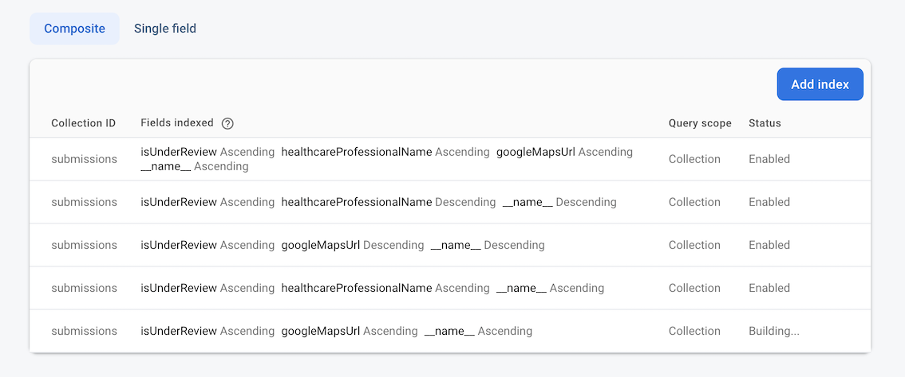

[](#contributors)

# Find a Doc, Japan - Server

## Back-end Repository

Welcome to the back-end repository for Find a Doc, Japan! We're not currently looking for contributors in this particular repo, but you're free to have a look around. If you want to provide any suggestions or feedback, come have a chat with us in the [#backend-team channel on Slack](https://join.slack.com/t/find-a-doc/shared_invite/zt-s4744a6o-MGaGHzLN5wB9aXeha3vdsQ)!

### How to contribute

We love and welcome contributions to our front-end repository which can be found [here](https://github.com/ourjapanlife/findadoc-web)!

## Contributors

<!-- ALL-CONTRIBUTORS-LIST:START - Do not remove or modify this section -->
<!-- prettier-ignore-start -->
<!-- markdownlint-disable -->
<table>
  <tbody>
    <tr>
      <td align="center" valign="top" width="14.28%"><a href="http://www.annkilzer.net/"><br /><sub><b>Ann Kilzer キルザー杏</b></sub></a><br /><a href="https://github.com/ourjapanlife/findadoc-server/commits?author=ann-kilzer" title="Code">💻</a></td>
      <td align="center" valign="top" width="14.28%"><a href="https://github.com/theyokohamalife"><br /><sub><b>LaShawn Toyoda</b></sub></a><br /><a href="https://github.com/ourjapanlife/findadoc-server/commits?author=theyokohamalife" title="Code">💻</a></td>
      <td align="center" valign="top" width="14.28%"><a href="https://github.com/ermish"><br /><sub><b>Philip Ermish</b></sub></a><br /><a href="https://github.com/ourjapanlife/findadoc-server/commits?author=ermish" title="Code">💻</a></td>
      <td align="center" valign="top" width="14.28%"><a href="https://github.com/RageZBla"><br /><sub><b>Olivier Lechevalier</b></sub></a><br /><a href="https://github.com/ourjapanlife/findadoc-server/commits?author=RageZBla" title="Code">💻</a></td>
      <td align="center" valign="top" width="14.28%"><a href="https://github.com/evan-desu"><br /><sub><b>Evan Peterson</b></sub></a><br /><a href="https://github.com/ourjapanlife/findadoc-server/commits?author=evan-desu" title="Code">💻</a></td>
      <td align="center" valign="top" width="14.28%"><a href="https://github.com/Anissa3005"><br /><sub><b>Anissa Chadouli</b></sub></a><br /><a href="https://github.com/ourjapanlife/findadoc-server/commits?author=Anissa3005" title="Code">💻</a></td>
    </tr>
  </tbody>
</table>

<!-- markdownlint-restore -->
<!-- prettier-ignore-end -->

<!-- ALL-CONTRIBUTORS-LIST:END -->

## Prerequisites

-   [Node](https://nodejs.org)
    -   We recommend using [nvm](https://github.com/nvm-sh/nvm) and running `nvm use` in this directory to sync with the project's Node version. However, if you wish to install Node your own way and ensure a consistent version with `.nvmrc`, that's fine too
-   [Yarn Berry](https://yarnpkg.com/getting-started/install)
-   [Docker Desktop](https://www.docker.com/products/docker-desktop/)

# Setup

## 1. Install dependencies

```sh
yarn
```

## 2. Set up Husky Hooks 🐕️

This will automatically run linting before commits and reduce common contributor mistakes.

```sh
yarn prepare
```

## 3. Setting up the Database 🐘

For simplicity, we use firebase!

For security, we run a local database so we don't break production!

(optional) You can point to different database environments simply by changing the firebase url and variables in the `.env.dev` file.

### 3.a Setup Firebase CLI

#### a.1 Install the Firebase CLI if you do not have it installed on your machine:

```sh
yarn dlx firebase-tools
```

**To be able to run the firestore emulator you need to have Java version 11 or later installed. If not installed, please follow the next step (a.2).**

#### a.2 Install Java

on a mac, we recommend using [homebrew](https://brew.sh/)

```sh
brew install openjdk
```

on a windows pc, we recommend using [chocolatey](https://chocolatey.org/)

```sh
choco install openjdk
```

**You might have to restart vs code for step a.2 and a.3 all of these to take effect in the project**

#### a.3 Log into Firebase CLI:

```sh
firebase login
```

### 3.b Running the database locally

```sh
yarn dev:startlocaldb
```

This will run until you shut down the instance hitting `ctrl^+C`

### (Optional) Connecting to Production database

#### Setting Up Firebase Service Account

To set up the Firebase Service Account for this project, follow these steps:

1. Visit [Firebase console](https://console.firebase.google.com/project/find-a-doc-japan/overview).
2. Under "Project Overview", click on "Project Settings".
3. Navigate to the "Service Accounts" tab.
4. Click the "Generate new private key" button. Ensure that Node.js is selected.
5. Download the JSON file and add it to the root directory of this project. Rename the file to `firebaseServiceAccountKey.json`.
6. In your `.env` file, create an environment variable called `SERVICE_ACCOUNT_PATH` with the value `./firebaseServiceAccountKey.json`.

## 4. Run the API

Before running the following command, make sure that your local database is running

```sh
yarn run dev
```

That's it! This command will start the API, seed your database, install dependencies, and generate our GraphQL types.

### (Optional) Running in production mode

In production, we use docker to run the app. You can validate your code works in production by running
Make sure that you have docker running beforehand.

```sh
yarn prod:build
yarn prod
```

# How to Debug your code

This runs locally and can easily be debugged with vscode!
Click on the `Run and Debug` vscode tab, and then choose `Javascript Debug Terminal`, then run `yarn dev` in there and the debugger will automatically connect.
Then, just add breakpoints by clicking on the line number of your code.

# How to Test your code

<details>
  <summary> Testing with Vitest </summary>

1. Start the Docker container:

```sh
yarn test:dockerstart
```

2. Run the tests:

```sh
yarn test
```

</details>

<details>
  <summary>Testing GraphQL</summary>

1. Run `yarn generate` to generate the types locally
2. Run `yarn dev` to start the local server
3. Open your browser to <http://localhost:3001/>
4. Navigate to the Explorer section from the menu in the left pane.
5. Click `query: Query` under "Root Types
   
6. Click the `+` button to see the fields a **type** has that can be added to the query
   

7. Select the desired fields and they'll automatically get added to the query builder
   

8. If you select a type that requires an ID (such as `Facility` or `HealthcareProfessional`) then add the ID in the "Variables" window at the bottom _as a string_.



9. If you'd like to share the query you built, such as demonstrating how you tested your code, check out [Apollo Explorer's sharing features](https://www.apollographql.com/blog/announcement/platform/save-and-share-your-graphql-operations-in-apollo-explorer/#sharing-a-collection).

</details>

# Troubleshooting

<details>
  <summary>Firestore Indexing Error: "The query requires an index..."</summary>

When you running query using the `getSubmissions` method that requires ordering by a specific field, if an index hasn't been created for the combination of that field and the order direction, you might receive an error response. This response will typically contain a direct link to create the required index in the **Firebase Console**. Here's how you can proceed:

1. Click on the link in the `Error Response`: This link will redirect you to the Firebase Console, specifically to the Firestore section where you can create indices.



2. In the Firebase Console, you should see a window labeled `Create or update indexes`. Click the `Save` button: This will initiate the process of creating the index. Index creation might take a few minutes.



3. Wait for the Index to be ready: Firestore will show the status of the index. Once it changes from `Building` to `Enabled`, you can proceed to run your GraphQL query again.



4. Run Your GraphQL Query Again: With the index in place, your query should now execute without any errors related to indexing.

</details>
